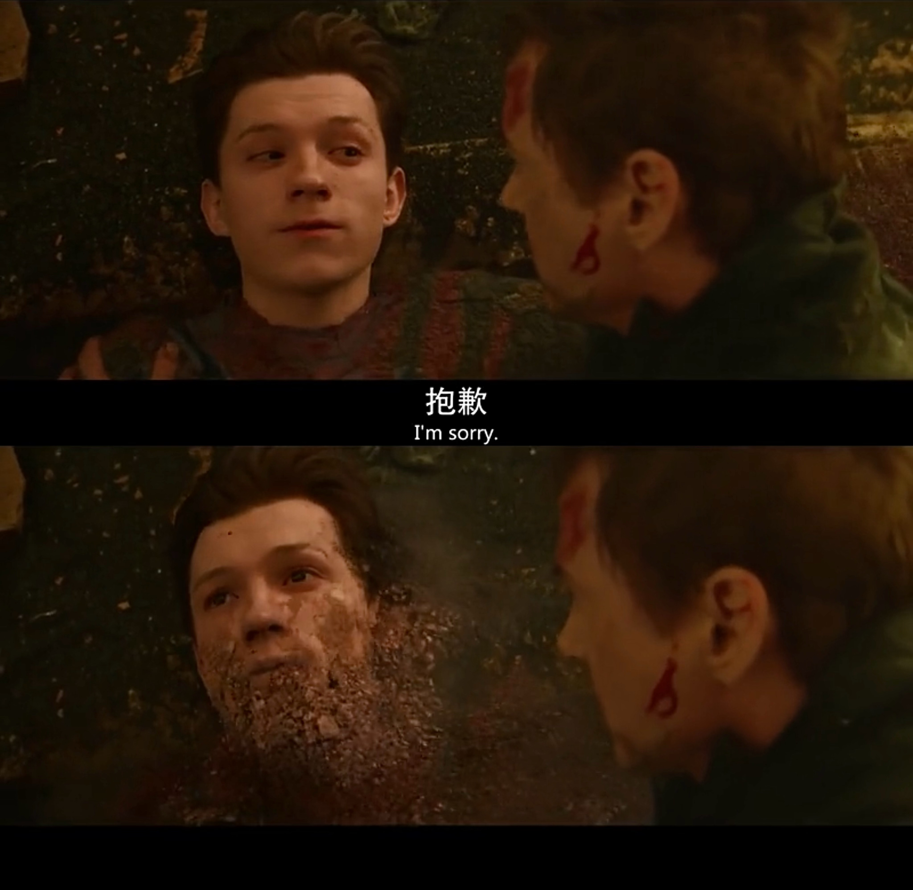

# cwan_9103_tut5
## Week 8 Quiz
### Part 1: Imaging Technique Inspiration
__Among the works of art provided for the major assignment, I am more interested in the Wheels of Fortune in Pacita Abad. This work is made up of many circles and small particles.__

__That reminds me of when Thanos snaps his fingers and a lot of people disappear into particles in the Avengers.__

__I think this effect is interesting and suitable to add to the final task. I want the original pattern to break down into particles that float away when I click the keyboard or mouse.__

### Part 2: Coding Technique Exploration

__I found a tutorial about falling sand simulator from The Coding Train. This coding technique simulates sand by setting some pixels in the canvas and adding gravity to those pixels so that they can fall. I think this technique can achieve the effect I'm looking for, and while I can't make the particles float away, falling sand can have a similar effect. I can draw the pattern with the pixels and then make the particles that make up the pattern fall in droves into a puddle of sand with the falling sand simulator.__

### Coding technique in action
1. Example 1
[SANDWATCH](https://eirikhodne.no/kode-eksempler/Klokker/Sandklokke/)

_The pixels that make up the number fall through time._

2. Example 2
[IMAGE TO SAND](https://editor.p5js.org/dozsolti/sketches/jRnf6QPCD)

_The pixels that make up the picture fall by clicking._